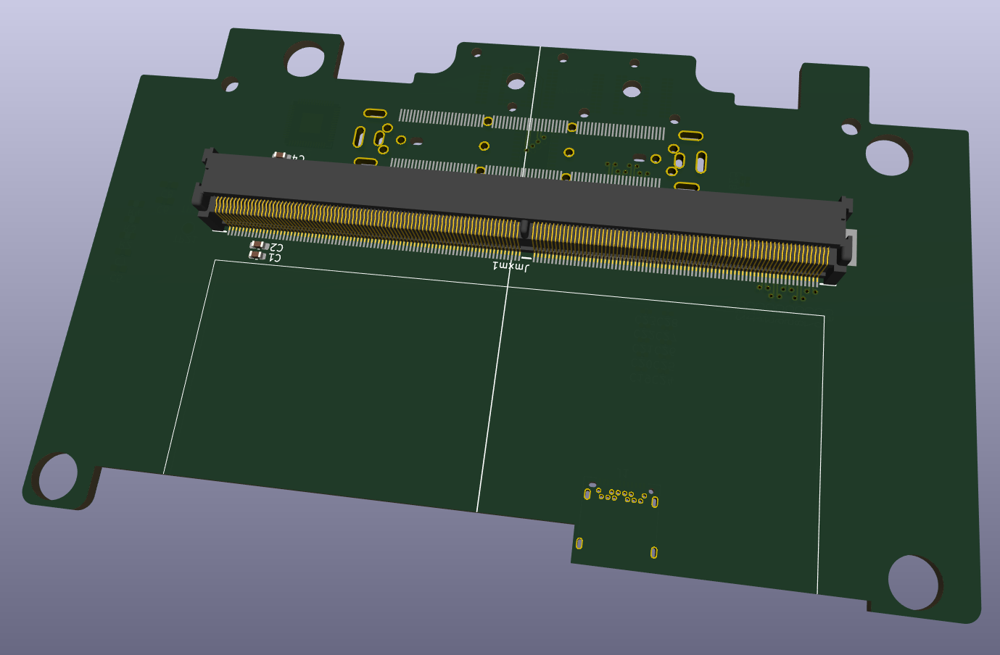

# MXM GPU + Dell E-Port expansion card for 16" Framework laptop

This is a board meant to fit in the GPU expansion bay of the 16" Framework laptop. Its primary purpose is to add Dell E-port dock support, but since that requires display outputs, an MXM GPU slot is added as well.

This is a very unfinished project that I started when the 16" Framework laptop was announced, but I probably won't be working on it much anymore since I don't plan on actually buying the laptop. I'm putting it here for anyone who might be interested.

The intent was to use the RP2040 to deal with dock port interfaces such as PS/2, I2S audio, and whatever other control signals it needs to function.

MXM part is based on my work on another project: MXM Immobilizer, a PCIe to MXM adapter.

I've manually created the E-port dock connector footprint from the part datasheet: https://www.mouser.com/pdfdocs/JAEMB-0200-1E_WD2.pdf

Dell's E-port dock uses the JAE WD2 series dock connectors. Part numbers commonly mentioned in applicable schematics are:
* JAE_WD2F144WB5R400 (M4800)
* JAE_WD2F144WB1R300 (E6440)
* JAE_WD2F144WBHR500-DT (E7470)
* JAE_WD2F144WD3 (E4300)
* JAE_WD2F144WD4 (E4200)
* JAE_WD2F144WB3R300 (E4310)
* JAE_WD2F144WB7-DT (E7440)

Plus a Foxconn alternative used in some of the lasts models:
* FOX_QL01723-D265G1-8H (Precision 7510)

